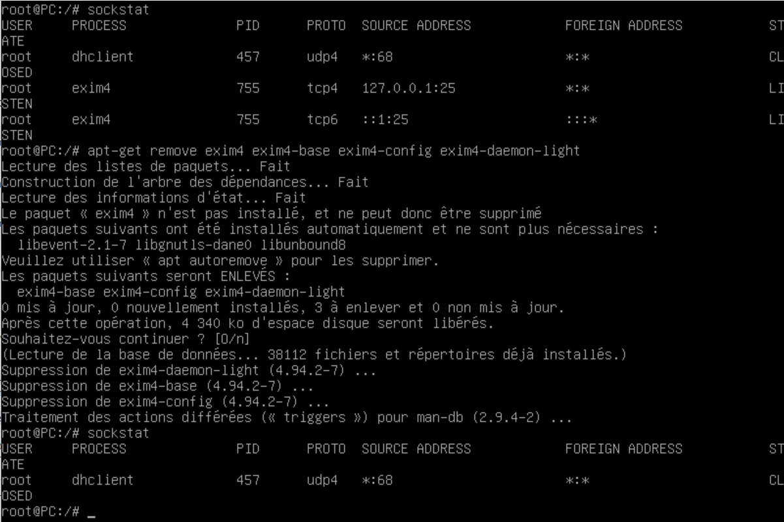
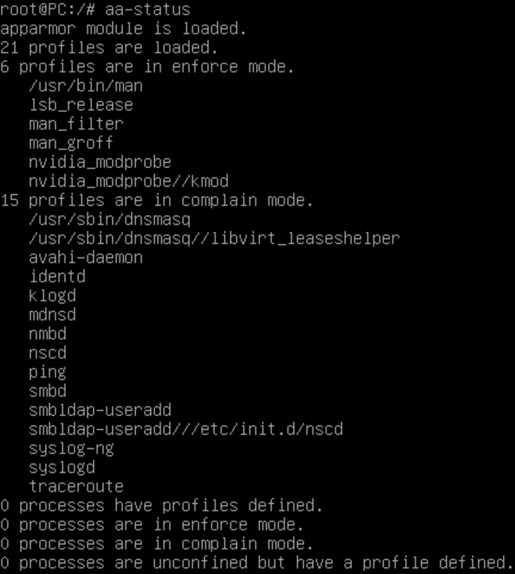

# <u>Rapport Durcissement OS</u>
**Date de réalisation** 14/09/2022 jusqu'au 02/12/2022  
**Auteur** : CHAPRON Lucas et DENOUË Enzo
**Enseignant** : BREYAULT Julien  
**OS** : Debian 11.5
**Guide utilisé** : Recommandations de configuration d'un système GNU/Linux  
**URL** : https://www.ssi.gouv.fr/uploads/2019/02/fr_np_linux_configuration-v2.0.pdf

## <u>Identifiants</u>
###### <u>PHRASE SECRETE SCSI2 PARTITION 5</u>
**MDP:** ``&S$0E3d%mZc1#QCuIoi$``

###### <u>ROOT</u>
**ID :** ``root``
**MDP :** ``Z#T!wO23H7$2!#7Mn%N7``

###### <u>USER</u>
**ID :** ``user``
**MDP :** ``xc$my68!wuNkeixwe0u6``

## <u>Liste rapports Lynis</u>
- report1_installation.html
- report2_fin_mesures_minimales.html
- report3_fin_mesures_intermediaires.html

## <u>Liste des mesures et de leur impact</u>
### <u>Minimales</u>

##### R30 : <u>Désactiver les comptes utilisateur inutilisés</u>
> Les comptes utilisateur inutilisés doivent être désactivés au niveau du système.

*Voir les utilisateurs :* 
``grep bash /etc/passwd | cut -f1 -d:``

*Supprimer un utilisateur :*
``userdel -r <loginasupprimer>``
**Pas de compte utilisateur inutilisé**

##### R31 : <u>Utiliser des mots de passe robustes</u>
> Il est conseillé d’appliquer les recommandations de la note technique « Recommandations relatives à l’authentification multifacteur et aux mots de passe ».
Ce mot de passe doit être unique et propre à chaque machine.

Pour changer de mot de passe :
``passwd``
###### Longueur du mot de passe


**Mot de passe admin : Z#T!wO23H7$2!#7Mn%N7**
*Longueur du mot de passe = 20*
Pour les mots de passe ne pouvant pas être mémorisé par un humain, L'ANSSI préconise une longueur de 20 caractères au moins.
###### Politique de renouvellement du mot de passe
**Mot de passe *root* renouvellé tout les ans**

**Mot de passe *user* renouvellé tout les ans**


##### R53 : <u>Eviter les fichiers ou répertoires sans utilisateur ou sans groupe connu</u>
> Les fichiers ou répertoires sans utilisateur ou groupe identifiable par le système doivent être analysés et éventuellement corrigés afin d’avoir un propriétaire ou un groupe connu du système.

*Voir les fichiers sans utilisateurs ou groupe associé :*
``find / -type f \( -nouser -o -nogroup \) -ls 2>/dev/null``

Aucun fichier ou répertoire sans utilisateur ou sans groupe connu

Capturé le 02-11-2022

##### R54 : <u>Activer le sticky bit sur les répertoires inscriptibles</u>
>Tous les répertoires accessibles en écriture par tous doivent avoir le sticky bit positionné.

*Activer sticky bit sur un fichier ou répertoire :*
``sudo chmod +t <nom fichier/repertoire>``

*Commande permettant de lister l'ensemble des répertoires modifiables par tous et sans sticky bit :*
``find / -type d \( -perm -0002 -a \! -perm -1000 \) -ls 2>/dev/null``

Aucun répertoire modifiable par tous et sans sticky bit


*Commande permettant de lister l'ensemble des répertoires modifiables par tous et dont le propriétaire n'est pas root :* 
``find / -type d -perm -0002 -a \! -uid 0 -ls 2>/del/null``

Aucun répertoire modifiable par tous et dont le propriétaire n'est pas root

Capturés le 02-11-2022

##### R56 : <u>Eviter l'usage d'exécutables avec bits setuid et setgid</u>
> R56 : Seuls les logiciels de confiance issus, par exemple, de la distribution ou de dépôts officiels de paquets et spécifiquement conçus pour être utilisés avec les droits spéciaux setuid ou setgid peuvent avoir ces droits positionnés.

*La commande suivante permet de retirer les droits spéciaux setuid ou setgid :*
``chmod u-s <fichier> # Retire le droit spécial setuid``
``chmod g-s <fichier> # Retire le droit spécial setgid``

**Liste des exécutables système avec bit setuid root :**
*La commande suivante permet de lister l’ensemble des fichiers avec les droits spéciaux setuid et setgid présents sur le système :*
``find / -type f -perm /6000 -ls 2>/dev/null``

Si autres exécutables que ceux-là alors il faut se poser la question de l'utilité des exécutables en question.

Capturé le 19-10-2022

##### R58 : <u>N'installer que les paquets strictement nécessaires</u>
> Le choix des paquets doit conduire à une installation aussi minimale que possible, se limitant à ne sélectionner que ceux qui sont nécessaires au besoin.

*Être sûr que les paquets inutiles sont désinstallés :* 
``apt-get autoremove``

##### R59 : <u>Utiliser des dépôts de paquets de confiance (dépôts officiels)</u>
>Seuls les dépôts internes à l’organisation ou officiels (de la distribution ou de d’un éditeur) doivent être utilisés.

*Lister les dépôts :*
``cat /etc/apt/sources.list`` 


Capturé le 13-10-2022

Si autres dépot que debian alors il faut corriger
*Pour désinstaller un dépôt :*
``apt remove --purge <nom du dépôts>``

##### R61 : <u>Effectuer des mises à jour régulières</u>
> Il est recommandé d’avoir une procédure de mise à jour de sécurité régulière et réactive.

**Dernière mise à jour : 30-11-2022 16:45**
*Historique de mise à jour :*
- 21-11-2022 11:34
- 10-11-2022 10:02
- 02-11-2022 10:27
- 19-10-2022 9:58
- 13-10-2022 9:50
###### Système de MàJ automatiques via *unattended-upgrades*
**Date d'installation de l'outil *unattended-upgrades* : 13-10-2022 10:46**
``apt-get install unattended-upgrades apt-listchanges``

``editor /etc/apt/apt.conf.d/50unattended-upgrades``

###### Système de Log automatiques avec *unattended-upgrades*
##### R62 : <u>Désactiver les services non nécessaires</u>
> Seuls les composants strictement nécessaires au service rendu par le système doivent être installés.
Tout service, et particulièrement ceux en écoute active sur le réseau, est un élément sensible. Seuls ceux connus et requis pour le fonctionnement et la maintenance doivent être installés. Il est recommandé de désinstaller les services dont la présence ne peut être justifiée ou de les désactiver si leur désinstallation n’est pas possible.

*Pour lister les services installés sur le système :* 
``systemctl list-units --type service `` OU ``dpkg --list``
*Désinstallation des services de bluetooth :*
``sudo apt-get autoremove blueman bluez-utils bluez bluetooth``

##### R68 : <u>Protéger des mots de passe stockés</u>
> Tout mot de passe doit être protégé par des mécanismes cryptographiques évitant de les exposer en clair à un attaquant. Pour cela, se référer à la section 4.6 Stockage de mots de passe du guide Recommandations relatives à l’authentification multifacteur et aux mots de passe [9].

*Application utilisant PAM :*

Capturé le 10-11-2022

**Configuration du PAM afin d'utiliser yescrypt :**
*Ajouter dans le fichier /etc/pam.d/common-password la directive suivante :*
``password required pam_unix.so obscure yescrypt rounds=11``


Capturé le 10-11-2022

##### R80 : <u>Réduire la surface d'attaque des services réseau</u>
> Tous les services réseau doivent être en écoute sur les interfaces réseau adéquates.

*La commande suivante permet de lister l’ensemble des services en écoute sur le réseau :*
``ss -aelonptu``
*Liste des processus résidents :*
``ps aux``
*Désinstallation du service dbus et désactivation du service exim4 :*
``apt remove --purge dbus``
``systemctl disable exim4``
**Suppression du service *exim4* :**


### Intermédiaires</u>

##### R2 : <u>Configurer le BIOS/UEFI</u>
> Il est conseillé d’appliquer les recommandations de la configuration du BIOS/UEFI mentionnées dans la note technique « Recommandations de configuration matérielle de postes clients et serveurs x86 » [2].

**Non applicable sur machine virtuelle.**

##### R3 : <u>Activer le démarrage sécurisé UEFI</u>
>Il est recommandé d’activer la configuration du démarrage sécurisé UEFI associée à la distribution.

*Installation de mokutil :*
``apt-get install -y mokutil``
*Vérifier si le système a démarré avec SecureBoot :*
``mokutil --sb-state``


**On s'apperçoit que la règle n'est pas applicable pour une machine virtuelle.**

##### R5 : <u>Configurer un mot de passe pour le chargeur de démarrage (GRUB)</u>
> Un chargeur de démarrage permettant de protéger son démarrage par mot de passe est à privilégier. Ce mot de passe doit empêcher un utilisateur quelconque de modifier ses options de configuration.
Quand le chargeur de démarrage n’offre pas la possibilité de lui adjoindre un mot
de passe, une autre mesure technique ou organisationnelle doit être mise en place
afin de bloquer toutes tentatives de modification des options de configuration par
un utilisateur non-autorisé.

**Déjà fait lors de l'installation de la machine virtuelle.**

##### R8 : <u>Paramétrer les options de configuration de la mémoire</u>
> Les listes ci-dessous présentent les options de configuration de la mémoire recommandées.

>Les options de configuration de la mémoire détaillées dans cette liste sont à ajouter
à la liste des paramètres du noyau lors du démarrage en plus de celles déjà présentes dans le fichier de configuration du chargeur de démarrage :
■ l1tf=full,force : active sans possibilité de désactivation ultérieure toutes les contremesures pour la vulnérabilité L1 Terminal Fault (L1TF) présente sur la plupart des processeurs Intel (en 2018 tout du moins). À noter que cela désactive
Symmetric MultiThreading (SMT) et peut donc avoir un impact fort sur les performances du système. Cette option n’est toutefois nécessaire que lorsque le système est susceptible d’être utilisé comme hyperviseur. Si les machines virtuelles
sont de confiance, c’est-à-dire avec un système d’exploitation invité à la fois de
confiance et protégé contre la vulnérabilité L1TF, cette option n’est pas nécessaire
et peut même être remplacée par l1tf=off pour maximiser les performances;
■ page_poison=on : active le poisoning des pages de l’allocateur de pages (buddy
allocator). Cette fonctionnalité permet de remplir les pages libérées avec des
motifs lors de leur libération et de vérifier les motifs lors de leur allocation. Ce
remplissage permet de réduire le risque de fuites d’informations à partir des données libérées;
■ pti=on : force l’utilisation de Page Table Isolation (PTI) y compris sur les processeurs se prétendant non impactés par la vulnérabilité Meltdown;
■ slab_nomerge=yes (équivalent à CONFIG_SLAB_MERGE_DEFAULT=n) : désactive la fusion de caches slabs (allocations mémoire dynamiques) de taille identique. Cette fonctionnalité permet de différentier les allocations entre les différents caches slabs, et complique fortement les méthodologies de pétrissage du tas (heap massaging) en cas de heap overflow;
■ slub_debug=FZP : active certaines options de vérification des caches slabs (allocations mémoire dynamiques) :
> F active les tests de cohérence des métadonnées des caches slabs,
> Z active le Red Zoning; dans un cache slab, ajoute une zone rouge après chaque
objet afin de détecter des écritures après celui-ci. Il est important de noter que
la valeur utilisée pour la zone rouge n’est pas aléatoire et qu’il s’agit donc d’un
durcissement bien plus faible que l’utilisation de véritables canaris,
> P active le poisoning des objets et du padding, c’est-à-dire provoque une erreur
lors de l’accès aux zones empoisonnées ;
■ spec_store_bypass_disable=seccomp : force le système à utiliser la contre-mesure par défaut (sur un système x86 supportant seccomp) pour la vulnérabilité Spectre v4 (Speculative Store Bypass);
■ spectre_v2=on : force le système à utiliser une contre-mesure pour la vulnérabilité Spectre v2 (Branch Target Injection). Cette option active spectre_v2_user=on qui évite les attaques Single Threaded Indirect Branch Predictors (STIBP) et Indirect Branch Prediction Barrier 12(IBPB);
■ mds=full,nosmt : force le système à utiliser Microarchitectural Data Sampling
(MDS) pour atténuer les vulnérabilités des processeurs Intel. L’option mds=full,
qui laisse Symmetric MultiThreading (SMT) activé, n’est donc pas une atténuation complète. Cette atténuation nécessite une mise à jour du microcode Intel
et atténue également la vulnérabilité TSX Asynchronous Abort (TAA) du processeur Intel sur les systèmes affectés par MDS ;
■ mce=0 : force un kernel panic sur les erreurs non corrigées signalées par le support Machine Check. Sinon, certaines d’entre elles provoquent uniquement l’envoi d’un SIGBUS, permettant potentiellement à un processus malveillant de continuer à essayer d’exploiter une vulnérabilité par exemple Rowhammer;
■ page_alloc.shuffle=1 (équivalent à CONFIG_SHUFFLE_PAGE_ALLOCATOR=y) : active le Page allocator randomization qui améliore les performances pour l’utilisation du direct-mapped memory-side-cache mais réduit la prévisibilité des allocations de page et complète ainsi SLAB_FREELIST_RANDOM;
■ rng_core.default_quality=500 : augmente la confiance dans HWRNG du TPM
pour une initialisation robuste et rapide du CSPRNG de Linux en créditant la moitié
de l’entropie qu’il fournit.

**Non applicable sur machine virtuelle.**

##### R9 : <u>Paramétrer les options de configuration du noyau</u>
> La liste ci-dessous présente les options de configuration du noyau recommandées.
> kernel.dmesg_restrict=1
> kernel.kptr_restrict=2
> kernel.pid_max=65536
> kernel.perf_cpu_time_max_percent=1
> kernel.perf_event_max_sample_rate=1
> kernel.perf_event_paranoid=2
> kernel.randomize_va_space=2
> kernel.sysrq=0
> kernel.unprivileged_bpf_disabled=1
> kernel.panic_on_oops=1

*Vérification de la présence des configurations sysctl :*
``sysctl <nom de la configuration>``
*S'il faut la changer :*
``sysctl -w <nom de la configuration>=<valeur>``

##### R11 : <u>Activer et configurer le LSM Yama</u>
> Il est recommandé de charger le module de sécurité Yama lors du démarrage, par exemple en passant la directive security=yama au noyau, et d’affecter à l’option de configuration du noyau kernel.yama.ptrace_scope une valeur au moins égale à 1.

*Vérification de la présence des configurations sysctl :* 
``sysctl kernel.yama.ptrace_scope``
*S'il faut la changer :*
``sysctl -w kernel.yama.ptrace_scope=1``

Pas de passage de chargement du module yama au démarrage car la sécurité est prise en charge par AppArmor (Cf fin du wiki).

##### R12 : <u>Paramétrer les options de configuration du réseau IPv4</u>
> La liste ci-dessous présente les options de configuration du réseau IPv4 pour un hôte « serveur » typique qui n’effectue pas de routage et ayant une configuration IPv4 minimaliste (adressage statique).
> net.core.bpf_jit_harden=2
> net.ipv4.ip_forward=0
> net.ipv4.conf.all.accept_local=0
> net.ipv4.conf.all.accept_redirects=0
> net.ipv4.conf.default.accept_redirects=0
> net.ipv4.conf.all.secure_redirects=0
> net.ipv4.conf.default.secure_redirects=0
> net.ipv4.conf.all.shared_media=0
> net.ipv4.conf.default.shared_media=0
> net.ipv4.conf.all.accept_source_route=0
> net.ipv4.conf.default.accept_source_route=0
> net.ipv4.conf.all.arp_filter=1
> net.ipv4.conf.all.arp_ignore=2
> net.ipv4.conf.all.route_localnet=0
> net.ipv4.conf.all.drop_gratuitous_arp=1
> net.ipv4.conf.default.rp_filter=1
> net.ipv4.conf.all.rp_filter=1
> net.ipv4.conf.default.send_redirects=0
> net.ipv4.conf.all.send_redirects=0
> net.ipv4.icmp_ignore_bogus_error_responses=1
> net.ipv4.ip_local_port_range=32768 65535
> net.ipv4.tcp_rfc1337=1
> net.ipv4.tcp_syncookies=1

Vérification de la présence des configurations sysctl : 
``sysctl <nom de la configuration>``
S'il faut la changer : 
``sysctl -w <nom de la configuration>=<valeur>``

##### R13 : <u>Désactiver le plan IPv6</u>
> Quand IPv6 n’est pas utilisé, il est recommandé de désactiver la pile IPv6 en :
■ ajoutant la directive ipv6.disable=1 à la liste des paramètres du noyau choisi lors
du démarrage en plus de celles déjà présentes dans les fichiers de configuration
du chargeur de démarrage,
■ activant les options de configuration du réseau présentées dans la liste ci-dessous.
> net.ipv6.conf.default.disable_ipv6=1
> net.ipv6.conf.all.disable_ipv6=1

Vérification de la présence des configurations sysctl : 
``sysctl <nom de la configuration>``
S'il faut la changer : 
``sysctl -w <nom de la configuration>=<valeur>``

##### R14 : <u>Paramétrer les options de configuration des systèmes de fichiers</u>
> La liste ci-dessous présente les options de configuration des systèmes de fichiers recommandées au format du ficher de configuration sysctl.conf.

> fs.suid_dumpable=0
> fs.protected_fifos=2
> fs.protected_regular=2
> fs.protected_symlinks=1
> fs.protected_hardlinks=1

Vérification de la présence des configurations sysctl : 
``sysctl <nom de la configuration>``
S'il faut la changer : 
``sysctl -w <nom de la configuration>=<valeur>``

##### R28 : <u>Partitionnement type</u>
> Le partitionnement type recommandé est le suivant :


*Changement du type de partitionnement de la partition /root en nosuid, nodev dans le fichier /etc/fstab :*
 ``systemctl deamon-reload``

##### R32 : <u>Expirer les sessions utilisateurs locales</u>
> Les sessions utilisateur locales (console TTY, session graphique) doivent être verrouillées au bout d’un certain délai d’inactivité.

En ajoutant la ligne suivant au fichier ``/home/.bashrc`` :
``TMOUT=600`` (L'utilisateur sera déconnecté après 6 min d'inactivité)
Ne pas oublier de faire ``source .bashrc`` une fois le fichier modifié.

Capturé le 28-11-2022

##### R33 : <u>Assurer l'imputabilité des actions d'administration</u>
> Les actions d’administration nécessitant des privilèges doivent être tracées afin de pouvoir identifier l’administrateur à l’origine d’une activité malveillante.
Plusieurs approches permettent de répondre à cette problématique. Une première,
la plus courante, consiste à utiliser des comptes dédiés pour chaque administrateur
et à utiliser sudo pour toute commande privilégiée. Une seconde, plus puissante,
consiste à identifier l’utilisateur de manière unique sur le système, puis à journaliser
la création de tout processus avec auditd.
Plusieurs approches peuvent également être combinées pour avoir une meilleure
traçabilité.


*Verrouillage d'un compte :*
``usermod -L -e 1 <compte>``
*Désactivation du shell de login :*
``usermod -s /bin/false <compte>``
(Inutile ici de mettre en place cette règle car un seul admin sur la machine)

##### R34 : <u>Désactiver les comptes de service</u>
> Les comptes de service doivent être désactivés.

Aucun compte de service sur la machine.

##### R35 : <u>Utiliser des comptes de service uniques et exclusifs</u>
> Chaque service métier (nginx, php, mysql, …) ajouté par l’administrateur doit posséder son propre compte système dédié.

Aucun compte de service sur la machine.

##### R39 : <u>Modifier les directives de configuration sudo</u>
>Les directives suivantes doivent être activées par défaut :
**noexec** appliquer le tag NOEXEC par défaut sur les commandes
**requiretty** imposer à l’utilisateur d’avoir un tty de login
**use_pty** utiliser un pseudo-tty lorsqu’une commande est exécutée
**umask=0077** forcer umask à un masque plus restrictif
**ignore_dot** ignorer le « . » dans $PATH
**env_reset** réinitialiser les variables d’environnement

*Lignes à ajouter dans le fichier ``etc/sudoers`` :*
```
Defaults noexec,requiretty,use_pty,umask=0027
Defaults ignore_dot,env_reset
```


##### R40 : <u>Utiliser des utilisateurs cibles non-privilégiés pour les commandes sudo</u>
> Les utilisateurs cibles d’une règle doivent autant que possible être des utilisateurs non privilégiés (c’est-à-dire non root).

Le seul utilisateur (user) de la machine n'a pas le droit d'effectuer sudo (user n'est pas dans les sudoers)


##### R42 : <u>Bannir les négations dans les spécifications sudo</u>
> Les spécifications de commande ne doivent pas faire intervenir de négation.

Le seul utilisateur (user) de la machine n'a pas le droit d'effectuer sudo (user n'est pas dans les sudoers)

##### R43 : <u>Préciser les arguments dans la spécifications sudo</u>
> Toutes les commandes du fichier de configuration sudoers doivent préciser strictement les arguments autorisés à être utilisés pour un utilisateur donné.
L’usage de * (wildcard) dans les règles doit être autant que possible évité. L’absence d’arguments auprès d’une commande doit être spécifiée par la présence d’une chaîne vide ("").

Le seul utilisateur (user) de la machine n'a pas le droit d'effectuer sudo (user n'est pas dans les sudoers)

##### R44 : <u>Éditer les fichiers de manière sécurisée avec sudo</u>
> L’édition d’un fichier par sudo doit être réalisée au travers de l’éditeur de texte sudoedit.

L'édition et la création de fichier n'est autorisé que via ``sudoedit <fichier>``

L'édition via ``nano`` est proscrite à l'utilisateur :


##### R50 : <u>Restreindre les droits d'accès aux fichiers et aux répertoires sensibles</u>
> Les fichiers et les répertoires sensibles ne doivent être lisibles que par les utilisateurs ayant le strict besoin d’en connaître.

``chmod 600 <fichier>``

##### R52 : <u>Restreindre les accès aux sockets et aux pipes nommées</u>
> Les sockets et pipes nommées doivent être protégées en accès par un répertoire possédant des droits appropriés. Les droits de la socket ou du pipe nommé doivent également restreindre les accès.

*Les commandes suivantes listent l’ensemble des sockets et les informations des processus associées pour des sockets locales :*
``sockstat``
``ss -xp``
*La commande suivante liste les renseignements sur l’utilisation des ressources IPC :*
``ipcs``
*La commande suivante liste l’ensemble des mémoires virtuelles partagées par les
processus et leurs droits d’accès associés :*
``ls /dev/shm``
*La commande suivante permet d’obtenir des informations détaillées sur les I/O et
IPC pour les processus du système :*
``lsof``

##### R55 : <u>Séparer les répertoires temporaires des utilisateurs</u>
> Chaque utilisateur ou application doit posséder son propre répertoire temporaire et en disposer exclusivement

/tmp est un répertoire partagé par tous les utilisateurs. Il est donc possible que des utilisateurs puissent accéder à des fichiers temporaires créés par d’autres utilisateurs.

Il existe un module qui permet de s’affranchir de ce problème : *tmpwatch*.
``apt install tmpwatch``
``vim /etc/cron.daily/tmpwatch``
``!/bin/sh``
``/usr/sbin/tmpwatch -m 1440 /tmp``

*pam_namespace* permet de créer des espaces de noms pour les utilisateurs.
``apt install libpam-namespace``
``vim /etc/pam.d/common-session``
``session required pam_namespace.so``
``vim /etc/pam_namespace.conf``
``user:tmp:/``

##### R63 : <u>Désactiver les fonctionnalités des services non essentielles</u>
>Les fonctionnalités configurées au niveau des services démarrés doivent être limitées au strict nécessaire.

*La commande suivante permet de lister l’ensemble des fichiers exécutables pour lesquels un ou plusieurs Linux capabilities ont été activées :*
``find / -type f -perm /111 -exec getcap {} \; 2>/dev/null``


##### R67 : <u>Sécuriser les authentifications distante par PAM</u>
> Quand l’authentification se déroule au travers d’une application distante (réseau), le protocole d’authentification utilisé par PAM doit être sécurisé (chiffrement du flux, authentification du serveur distant, mécanismes d’anti-rejeu…).

``/etc/pam.d/su`` *et* ``/etc/pam.d/su-l`` *pour limiter l’usage de* ``su`` *pour devenir root aux utilisateurs membres du groupe wheel seulement :*
```
# Limite l'accès à root via su aux membres du groupe 'wheel'
auth   required pam_wheel.so use_uid root_only
```


``/etc/pam.d/passwd`` *pour fixer des règles de complexité des mots de passe :*
```
# Au moins 12 caractères de 3 classes différentes parmi les majuscules,
# les minuscules , les chiffres et les autres en interdisant la répétition d'un caractère
password   required  pam_pwquality.so minlen=12 minclass=3 \
                     dcredit=0 ucredit=0 lcredit=0 \
                     ocredit=0 maxrepeat=1
```


``/etc/pam.d/login`` *et* ``/etc/pam.d/sshd`` *pour bloquer automatiquement des comptes :*
```
# Blocage du compte pendant 5 min après 3 échecs
auth   required  pam_faillock.so deny=3 unlock_time=300
```


##### R69 : <u>Sécuriser les accès aux bases utilisateurs distantes</u>
> Lorsque les bases utilisateur sont stockées sur un serveur réseau distant, NSS doit être configuré pour établir une liaison sécurisée permettant au minimum d’authentifier le serveur et de protéger le canal de communication.

Les bases d'utilisateur ne sont pas stockées sur un serveur réseau distant.

##### R70 : <u>Séparer les comptes système et d'administrateur et l'annuaire</u>
> Il est recommandé de ne pas avoir de recouvrement de compte entre ceux utilisés par le système d’exploitation et ceux utilisés pour administrer l’annuaire. L’usage de comptes administrateur d’annuaire pour effectuer des requêtes d’énumération de comptes par NSS doit être prohibé.

Les bases d'utilisateur ne sont pas stockées sur un serveur réseau distant.

##### R74 : <u>Durcir le service de messagerie locale</u>
> Quand un service de messagerie est installé sur la machine, il doit être configuré pour n’accepter que :
■ les messages à destination d’un compte utilisateur local à la machine;
■ les connexions sur l’interface réseau de la boucle locale, les connexions distantes au service de messagerie doivent être rejetées.

Pas de messagerie sur la machine

##### R75 : <u>Configurer un alias de messagerie des comptes de service</u>
> Pour chaque service exploité sur le système, ainsi que pour le compte d’administrateur (ou root), un alias vers un compte utilisateur administrateur doit être configuré afin que celui-ci reçoive les notifications et les rapports adressés par messagerie électronique.

Pas de messagerie sur la machine

##### R79 : <u>Durcir et surveiller les services exposés</u>
> Les services exposés à des flux non maîtrisés doivent être durcis et particulièrement surveillés. Cette surveillance consiste à caractériser le comportement du service, et à reporter tout écart par rapport à son fonctionnement nominal déduit des spécifications initiales attendues.

Deux services sont en fonctionnement sur la machine : 
**systemd-timesyn** qui permet de synchroniser l'horloge du système au réseau
**dhclient** qui fait référence au client DHCP


### Renforcées

##### R38 : <u>Créer un groupe dédié à l'usage de sudo</u>
> Un groupe dédié à l’usage de sudo doit être créé. Seuls les utilisateurs membres de ce groupe doivent avoir le droit d’exécuter sudo.

Création d'un sudogrp avec l'utilisateur *user* comme membre.


##### R57 : <u>Exécutables steuid root</u>
> R57 : Les exécutables avec les droits spéciaux setuid root et setgid root doivent être le moins nombreux possible. Lorsqu’il est attendu que seuls les administrateurs les exécutent, il faut leur retirer ces droits spéciaux (setuid ou setgid) et leur préférer les commandes comme su ou sudo, qui peuvent être surveillées.


## <u>AppArmor</u>
### <u>Installation</u>
```
$ sudo apt-get apparmor apparmor apparmor-utils apparmor-profiles auditd

$ sudo mkdir -p /etc/default/grub.d
$ echo 'GRUB_CMDLINE_LINUX_DEFAULT="$GRUB_CMDLINE_LINUX_DEFAULT apparmor=1 security=apparmor"' \
  | sudo tee /etc/default/grub.d/apparmor.cfg
$ sudo update-grub
$ sudo reboot
```
### <u>Inspecter l'état actuel</u>
#### Vérifier si AppArmor est activé (renvoie Y si vrai)
```
$ cat /sys/module/apparmor/parameters/enabled
```


#### Répertorier tous les profils AppArmor chargés (apps & processus) et détailler leur statut (enforced, complain, unconfined)
```
$ sudo aa-status
```


#### Lister les programmes qui, sans avoir de profil associé, exposent quand même un port de communication.</u>
```
$ sudo aa-unconfined
```


#### Passer en mode "complain" pour un profil donné
```sudo aa-complain /etc/apparmor.d/<nom_du_profil>```


